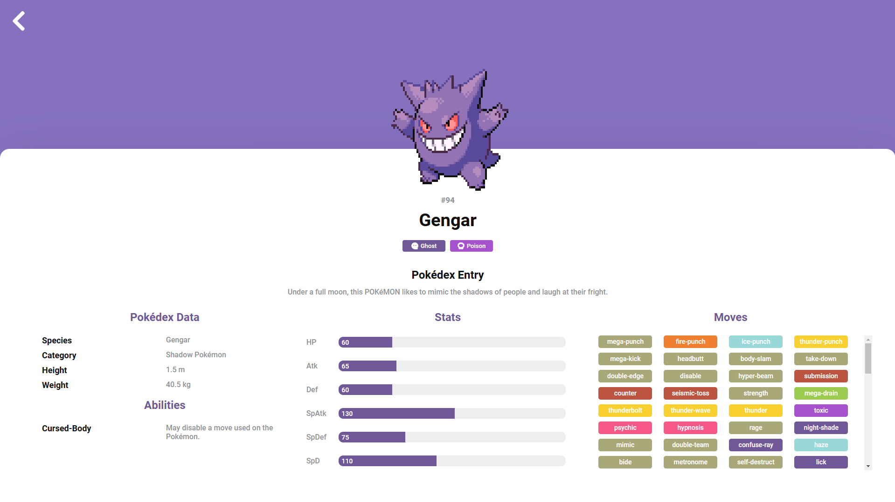

# Pokédex 📚👾✨


## 📌 Table of Contents

- [Pokédex 📚👾✨](#pokédex-)
  - [📌 Table of Contents](#-table-of-contents)
  - [🌐 Overview](#-overview)
  - [⚙️ Features](#️-features)
  - [💻 Technologies Used](#-technologies-used)
  - [🗝️ Key Takeaways](#️-key-takeaways)
  - [🚀 How to Run the Project](#-how-to-run-the-project)
  - [🖼️ Project Screenshots](#️-project-screenshots)
    - [Desktop Screenshots:](#desktop-screenshots)
    - [Mobile Screenshots:](#mobile-screenshots)
  - [🔗 Useful Links](#-useful-links)
  - [🤝 Contributing](#-contributing)
  - [💬 Contact](#-contact)

## 🌐 Overview

This application was developed to provide a Pokédex, allowing users to search for Pokémon, filter and view their specific details such as abilities, moves, stats, and more. It features both light and dark themes, seamless navigation, and a mobile-first design to ensure a great user experience across all devices.

## ⚙️ Features

- Search for Pokémons by their name.
- Filter Pokémons by their types.
- Display Pokémon details, including abilities, moves, stats, and descriptions.
- Toggle between light and dark themes.
- Easy navigation between the list of Pokémon and the detail page of a specific Pokémon.

## 💻 Technologies Used

- [React](https://reactjs.org/): JavaScript library for building user interfaces.
- [Styled Components](https://styled-components.com/): For dynamic and modular component styling.
- [React Router](https://reactrouter.com/): For application single-page routing management.
- [Local Storage](https://developer.mozilla.org/en-US/docs/Web/API/Window/localStorage): To persist the user's theme preference.
- [Context API](https://reactjs.org/docs/context.html): For managing the global state of the application.
- [React Icons](https://react-icons.github.io/react-icons/): For including popular icons in React projects.
- [PokéAPI](https://pokeapi.co/): For fetching detailed Pokémon data.

These tools were chosen for their popularity, flexibility, and robust support for developing modern, responsive applications.

## 🗝️ Key Takeaways

1. **Responsive Design**: Ensuring the application works seamlessly on both desktop and mobile devices.
2. **API Integration**: Leveraging external APIs to provide real-time data and enhance the application's functionality.
3. **User Experience**: Focusing on a smooth and intuitive user experience with theme toggles and easy navigation.
4. **Component-Based Architecture**: Building the application with reusable and maintainable components.

## 🚀 How to Run the Project

After cloning, downloading or forking, follow these steps:

1. **Install dependencies**:
    ```bash
    npm install
    ```

2. **Start the application**:
    ```bash
    npm run dev
    ```

## 🖼️ Project Screenshots

### Desktop Screenshots:





### Mobile Screenshots:

<div style="display: flex; justify-content: center;">
  
  
</div>

## 🔗 Useful Links

- [Live Demo](https://cauebf-pokedex-pokeapi.vercel.app) 
- [Project Repository](https://github.com/Cauebf/pokedex-pokeapi)

## 🤝 Contributing

Contributions are welcome! Feel free to open issues or pull requests for any improvements or bug fixes.

## 💬 Contact 

For any inquiries or collaboration opportunities, feel free to reach out via:

[](mailto:cauebrolesef@gmail.com)
[](https://www.linkedin.com/in/cauebrolesef/)
[](https://www.instagram.com/cauebf_/)
[](https://github.com/Cauebf)

<p align="right">(<a href="#pokedex-">back to top</a>)</p>